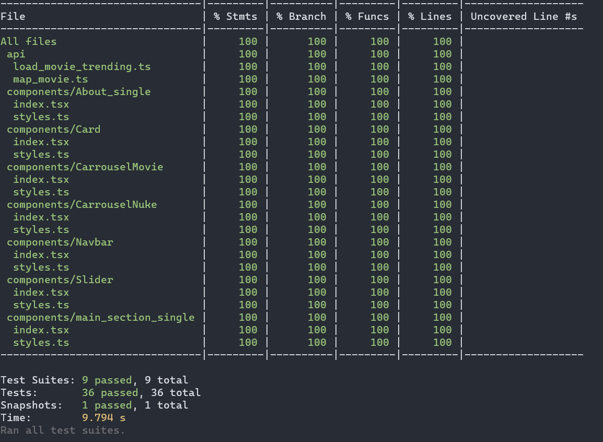

# Nextauth-Auth-Provider-jest

## Descrição do Projeto

<p align="center">O projeto NextAuthprovider  não teve um foco no css pois queria mais centrado em testes e no next auth para colocar o que eu aprendi sobre esses assunto.</p
 <h4 align="center">
	✅  Landing Page 🚀 Concluido...  ✅
 </h4>

 <!-- TABLE OF CONTENTS -->
<details open="open">
  <summary>Tabela de conteúdos</summary>
  <ol>
    <li>
      <a href="#Sobre-o-projeto">Sobre o projeto</a>
      <ul>
        <li><a href="#Tecnologias">Tecnologias</a></li>
      </ul>
       <ul>
        <li><a href="#Features">Features</a></li>
      </ul>
    </li>
    <li>
      <a href="#Getting-Started-in-the-my-application">Começando</a>
    </li>
    <li><a href="#Demonstração">Demonstração</a></li>
    <li><a href="#Contato">Contato</a></li>
  </ol>
</details>

## Sobre o projeto

O projeto como dito lá em cima foi feito com intuito de colocar em prática os meus conhecimentos sobre react(javascript) nesse projeto você vai observar os seguintes tópicos na sua criação:

React js

- hooks
- componentização
- hooks(useState)
- jest
- storybook
- etc.

### Tecnologias

- [x] NextAtuh,Next link

- [x] Jest

- [x] React

- [x] Nuka

- [x] Styled component

### Features

- [x] Carrosel e slider puro e outro com a lib "nuka-carousel" com css e javascript com recursos do react

- [x] Testes das funcionalidades e componentes com jest

- [x] Uso para criação de componente com storybook

## 🔥Demonstração

[](https://next-blog-lac-eight.vercel.app)

Next auth-Auth0


Nuka carousel


Totalmente testado



## Getting Started in the my application

This repository will serve as a base for other nextjs projects because with next you can run the following command

First, run the development server:

```bash
npx create-next-app --example https://github.com/julysNICK/Example-next
# or
yarn create next-app create-next-app -e https://github.com/julysNICK/Example-next
```

This is a [Next.js](https://nextjs.org/) project bootstrapped with [`create-next-app`](https://github.com/vercel/next.js/tree/canary/packages/create-next-app).

## Getting Started

second, run the development server:

```bash
npm run dev
# or
yarn dev
```

Open [http://localhost:3000](http://localhost:3000) with your browser to see the result.

You can start editing the page by modifying `pages/index.js`. The page auto-updates as you edit the file.

[API routes](https://nextjs.org/docs/api-routes/introduction) can be accessed on [http://localhost:3000/api/hello](http://localhost:3000/api/hello). This endpoint can be edited in `pages/api/hello.js`.

The `pages/api` directory is mapped to `/api/*`. Files in this directory are treated as [API routes](https://nextjs.org/docs/api-routes/introduction) instead of React pages.

## Learn More

To learn more about Next.js, take a look at the following resources:

- [Next.js Documentation](https://nextjs.org/docs) - learn about Next.js features and API.
- [Learn Next.js](https://nextjs.org/learn) - an interactive Next.js tutorial.

You can check out [the Next.js GitHub repository](https://github.com/vercel/next.js/) - your feedback and contributions are welcome!

## Deploy on Vercel

The easiest way to deploy your Next.js app is to use the [Vercel Platform](https://vercel.com/new?utm_medium=default-template&filter=next.js&utm_source=create-next-app&utm_campaign=create-next-app-readme) from the creators of Next.js.

Check out our [Next.js deployment documentation](https://nextjs.org/docs/deployment) for more details.

## Contato

Email: julysmartins54@gmail.com

linkedin:www.linkedin.com/in/julys-martins-2558651a3

Project Link: [https://github.com/julysNICK/Projeto-landing-page.git](https://github.com/julysNICK/Projeto-landing-page.git)
